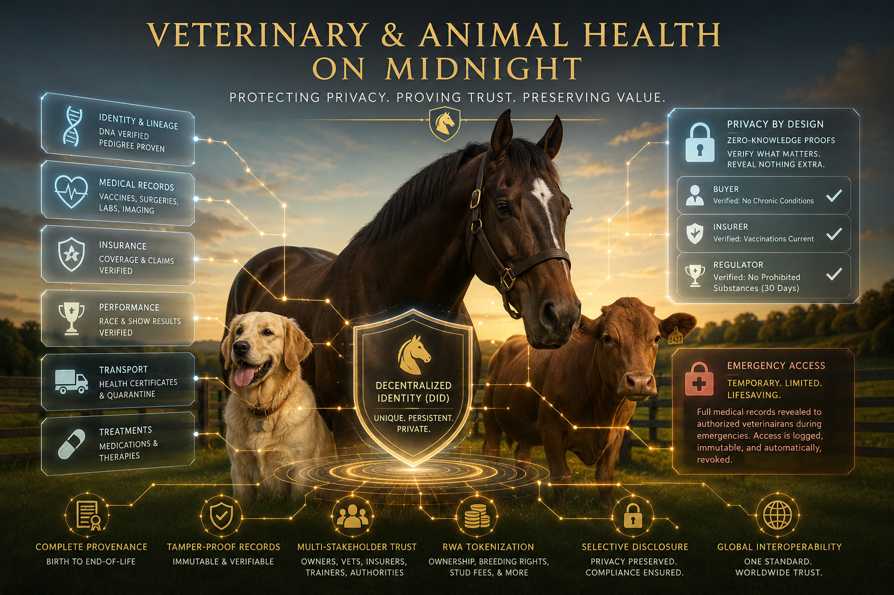

# EquinePro (equineProData)

> Privacy-preserving equine identity, records, provenance, and real world asset tokenized registries infrastructure on Midnight.

Part of the **DIDz ecosystem**.



---

## What Is EquinePro?

EquinePro is a premium equine data platform built on the [Midnight](https://midnight.network) blockchain. It provides:

- **Persistent Horse Identity** — Each horse gets its own DID that survives ownership transfers, boarding, training, breeding, and sale
- **Selective Disclosure** — Prove facts about a horse (vaccination status, medication compliance, breeding certification) without revealing the full medical file
- **Zero-Knowledge Proofs** — Midnight's Compact smart contracts verify assertions on-chain without exposing sensitive data
- **Folder-Based Record Architecture** — Health records, breeding, competition, transport, insurance, and compliance data organized into permissioned folders
- **Emergency Access** — Predefined emergency packets become accessible under cryptographically auditable conditions
- **RWA Infrastructure** — Ownership shares, breeding rights, stud contracts, lineage provenance, performance-linked valuation, and tokenized economic interests
- **Potential for fractionalization and crowdfunding**

---

## Architecture

```
EquinePro
├── Identity Layer (DIDz-style)
│   ├── Horse DID
│   ├── Owner DID
│   ├── Vet Practice DID
│   ├── Barn / Stable DID
│   ├── Trainer DID
│   ├── Breeder DID
│   ├── Insurer DID
│   └── Regulator / Event Authority DID
├── Data Layer (encrypted off-chain)
│   ├── Health records, labs, imaging
│   ├── Breeding & lineage docs
│   ├── Competition & performance logs
│   ├── Transport & movement docs
│   └── Insurance & compliance records
├── Privacy & Proof Layer (Midnight)
│   ├── Access grants & revocations
│   ├── Emergency reveal policy
│   ├── Compliance proofs
│   ├── Ownership attestations
│   └── Audit trail
└── App Layer
    ├── Owner app
    ├── Vet portal
    ├── Emergency responder portal
    ├── Barn / trainer portal
    ├── Insurer portal
    ├── Buyer / transfer portal
    └── Regulator / compliance portal
```

---

## Record Folders

| Folder | Description |
|--------|-------------|
| Identity | Registration, breed, markings, chip/brand |
| Vaccines | Vaccination records and compliance |
| Allergies | Known allergies and sensitivities |
| Medications | Current and past medications + withdrawal schedules |
| Surgeries | Surgical history |
| Lab Results | Blood work, panels, diagnostics |
| Imaging | X-rays, ultrasound, MRI |
| Chronic Conditions | Ongoing conditions (laminitis, colic history, etc.) |
| Insurance | Policy and claims data |
| Breeding | Lineage, genetic screens, reproductive records |
| Competition / Performance | Show, race, trial records |
| Transport / Movement | Interstate docs, Coggins, travel history |
| Dental | Dental records |
| Hoof / Farrier | Shoeing, hoof care, farrier notes |
| Nutrition | Diet, supplements, feeding plans |
| Behavioral Notes | Behavioral assessments |
| Research Consent | Study participation and opt-ins |
| End-of-Life / Transfer | Euthanasia directives, custody transfer |

---

## Key Workflows

1. **Horse Onboarding** — Create horse identity with registration, ownership, and vet-of-record
2. **Clinical Use** — Purpose-bound, folder-level access for vet visits and referrals
3. **Emergency Response** — Scan tag → instant access to critical medical facts only
4. **Ownership Transfer / Sale** — Selective disclosure for pre-purchase exams, provenance, breeding rights
5. **Competition Compliance** — Prove medication withdrawal status without revealing full history
6. **Insurance Claims** — Cryptographic proof of treatment, diagnosis, and invoice authenticity
7. **Breeding & Lineage** — Genetic screening proofs, lineage verification, stud contract management
8. **Research Marketplace** — Opt-in cohort matching with micropayments

---

## Three Verticals, One Architecture

EquinePro is the **equine** vertical of a three-vertical family that shares one privacy-preserving health-data architecture, plus a Real World Asset layer the other two verticals do not need:

| Vertical | Repo | Phase | What it does |
|----------|------|-------|--------------|
| 🐾 **PetProData** | [petProData](https://github.com/bytewizard42i/petProData) | Phase 0 | Companion animal records (dogs, cats, exotics) |
| 🐴 **EquinePro** | this repo | Phase 1 | Equine identity + RWA (ownership shares, breeding, lineage) |
| 🏥 **SafeHealthData** | [safeHealthData](https://github.com/bytewizard42i/safeHealthData_me) | Phase 2+ | Human inpatient + outpatient healthcare |

**Same Compact contracts. Same folder model. Same emergency reveal protocol. Same DIDz identity primitives.** EquinePro is Phase 1 because equine medicine is where multi-party consent is already normalized: a six-figure show jumper has owners, syndicates, trainers, breeders, vets, farriers, transporters, insurers, and event regulators all needing different scoped views into the same horse. Equine teaches the family how to handle 8+ stakeholders per case before SafeHealthData inherits the pattern for hospital rooms with 12+.

**What EquinePro adds and contributes forward**: RWA infrastructure (ownership shares, breeding rights, stud contracts, performance-linked valuation), multi-party consent flows, pre-purchase exam circuits, competition compliance / medication withdrawal proofs, breeding and lineage proofs, transport and interstate compliance (Coggins, USDA APHIS).

**What flows from PetProData into EquinePro**: folder model, permission graph, emergency reveal contracts, vaccine/allergy/medication circuits, owner-portal UX. EquinePro is a pure superset of the Phase 0 architecture.

**What flows from SafeHealthData back to EquinePro**: HIPAA-grade audit trail (becomes a marketing differentiator in equine syndicate disputes), bedside kiosk + RFID + biometric pattern from the [hospital room deep dive](https://github.com/bytewizard42i/safeHealthData_me/blob/main/docs/EVENTREVOLUTION_HOSPITAL_ROOM_DEEP_DIVE.md) (Phase 1 deploys at premium equine hospitals like Rood & Riddle, Hagyard, Wellington Equine), Ai inference consent layer, discharge soulbound NFT for owners and syndicate members, cross-species research via [STARSTREAM_HIPAA_PROOFS](https://github.com/bytewizard42i/safeHealthData_me/blob/main/docs/STARSTREAM_HIPAA_PROOFS.md).

See **[Three Verticals, One Architecture](https://github.com/bytewizard42i/safeHealthData_me/blob/main/docs/CROSS_VERTICAL_INTEGRATION.md)** (canonical reference in the SafeHealthData repo) for what transfers between verticals, identity mapping across species, and operational cross-pollination.

---

## Related Projects

| Project | Role |
|---------|------|
| [SafeHealthData](https://github.com/bytewizard42i/safeHealthData_me) | Parent platform, human healthcare (Phase 2+) |
| [PetProData](https://github.com/bytewizard42i/petProData) | Sister platform, companion animals (Phase 0) |
| [DIDz.io](https://github.com/bytewizard42i/didz-dapp-system) | Identity hub for the ecosystem |
| [KYCz](https://github.com/bytewizard42i/KYCz_us_app) | Owner / syndicate / vet / regulator verification |
| [SentinelDID](https://github.com/bytewizard42i/SentinelDID) | Emergency reveal policy contracts |
| [SilentLedger](https://github.com/bytewizard42i/SilentLedger) | Privacy-preserving financial records for syndicate ownership |
| [SharedScience](https://github.com/bytewizard42i/sharedScience_me) | Research marketplace (equine + cross-species cohort matching) |
| [EventRevolution](https://github.com/bytewizard42i/EventRevolution) | Bedside kiosk + RFID hardware reference (premium equine hospital pilot) |
| [ZKSplunk](https://github.com/bytewizard42i/ZKSplunk_Splunking_w_Midnight) | Equine farm and hospital operations dashboards + Ai diagnostics |
| [GeoZ](https://github.com/bytewizard42i/GeoZ_us_app_Midnight-Oracle) | Interstate transport and jurisdictional compliance (Coggins, USDA APHIS) |
| [DIDzMonolith](https://github.com/bytewizard42i/DIDzMonolith) | Monorepo containing all DIDz projects |

---

## Tech Stack

- **Smart Contracts**: Compact (Midnight)
- **App Layer**: TypeScript / JavaScript
- **Frontend**: React
- **Backend**: Node.js / Express
- **Storage**: Encrypted off-chain
- **Auth**: Wallet-based authorization via DIDz

---

## Origin

The concept of using animal health datasets as a precursor to semi-decentralized healthcare data for humans was proposed by [Orito (GoldRush)](https://x.com/TheGoldRush). The insight: establishing trust and legitimacy with animal health records first creates a proven, lower-stakes foundation before applying the same privacy-preserving infrastructure to human healthcare.

---

## Status

🏗️ **Architecture phase** — Design documents and workflow specifications in progress.

---

## License

TBD
